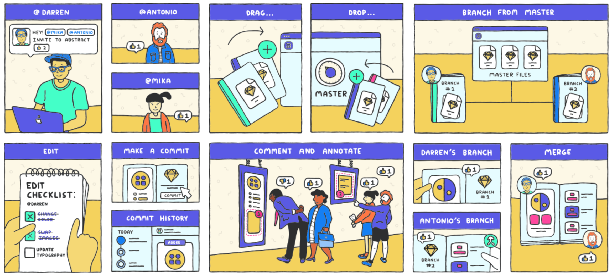
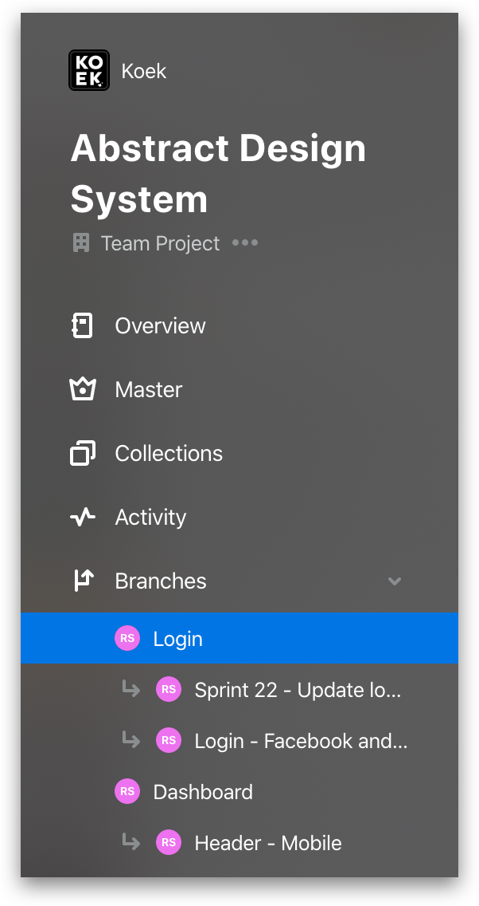
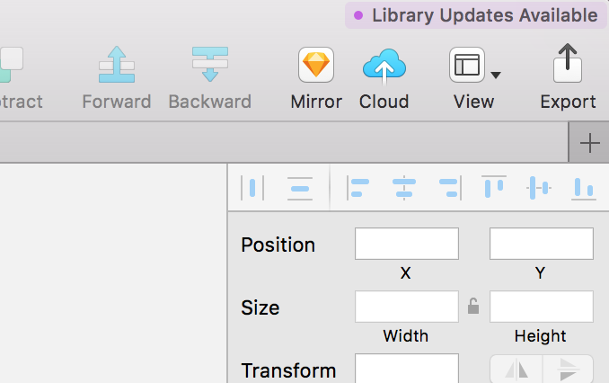
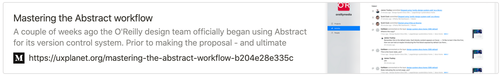

<!-- Hotjar Tracking Code for https://ruud.koek.link/biskit/docs/#/ -->

  

# Abstract
[Abstract](https://www.abstract.com) brings git-inspired version control & collaboration to your
 design team.

*Example of how Abstract works*
 

 ***

## Basics
- The master branch contains only designs that are approved by the design team and the client. It is not used for experiments and stuff that is not 100% certain to go to the development stage of the project.
- It's recommended to work in different artboards. This way you prevent a lot of merge conflicts.
- How you should work: Make artboards with different iterations and make a commit. When a iterations is agreed upon by the client and team, delete all other artboards and commit again. This way all iterations are saved (in the activity history) but the file is not cluttered with experiments. 
 

 ***

## Branches
- Always make a branch from the master file. This way we will have one source of truth at any time
- Create branches for specific purposes, this provides transparency to the team. Name the branch the way the ticket in Trello is named or name it something that is clear to everybody, so it's easy to reference later.  (For exmaple: instead of 'Marijn's Branch' go for 'Experiment with Hero size')
- Only update to master once the ticket is fully approved and reviewed
- Not all of your proposed changes will ultimately make it back to the Master. But those concepts can still end up being useful down the road. Branch Archives allow you to capture explorations that you might want to revisit later.
- When merge conflicts arise, please involve your team members when necessary to make the right decisions. Abstract doesn't provide the ability to pick and choose elements. It only allows you to pick one of two artboards or symbols.

 
 

              

 ***
## Shared Libraries
**A single source of truth for your design system.**

A Library is a Sketch document that contains Symbols that can be used globally. You can share the Library by storing to Abstract. As a result, your teammates can have access to the same Libraries.

When you update any Symbol in that Library, everyone that are using that Library will receive a notification on the far top right of Sketch's UI. Like this, their Libraries will be always in sync! 

         

Using Linked Libraries, you can truly work with one single source of truth. Example: Our products works with multi
platforms like mobile and web, and they all use the same set of icons. Now all those projects can all use the same
set of icons. Update an icon and the changes will propagate throughout wherever they’re being used. And thanks to
the way Abstract works, there’s a transparent paper trail of who made which changes and why, plus an easy way to
revert changes if needed.

**How to add a linked library**

1. Make sure you have your Library file(s) set up ([learn how](https://www.abstract.com/help/libraries/add-library/))
2. Go to the project you want to link this Library file to.
3. On the “Files” tab, click “Add File” and select “Link Library…”
4. In the window that appears, click on a project, select a Library file, and click “Link Library”.
  

 ***

## Commits
- Try to make commits of every milestone in the design process. You can always go back to previous commits. This also means you don't have to worry about deleting stuff, and thus keeping the file clean: You can always go back to previous state.
- Always try to be descriptive about what you did. This way everyone can see clearly what the commit contains, for future reference. Use a clear title and a description with a brief explanation of the things you've done.
  
        
***

## Reviews & Comments
Abstract has multiple ways to gather feedback from both colleagues as clients.
 

 

*Example of how Reviews & Comments work*
 

 ***

### Sources
 
         
 
 
 

