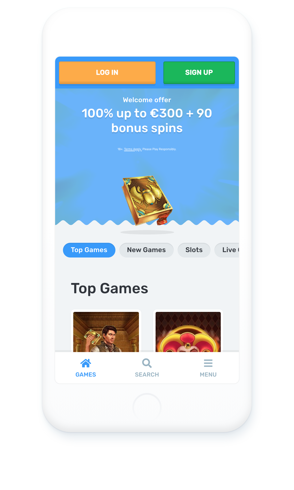
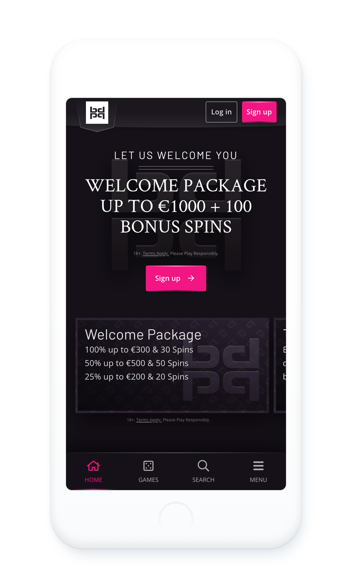
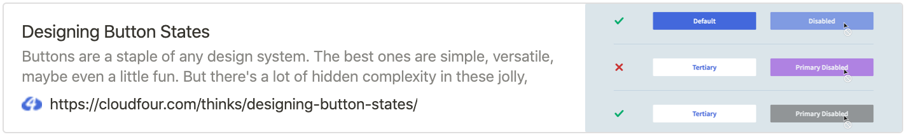
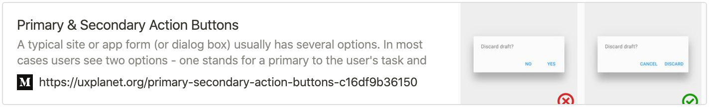

<br>
<html>
    <div class="github">
        <a href="https://github.com/Slaaatje/biskit-docs/edit/master/docs/buttons.md" target="_blank">Edit this page on GitHub
        </a>
    </div>
</html>

# Buttons
Buttons are clickable items used to perform an action.

## About Buttons
Buttons should be used in situations where users might need to:
- Submit a form.
- Begin a new task.
- Trigger a new UI element on the page.
- Specify a new or next step in a progress.
<br><br>

***


## States
Perhaps unsurprisingly, the standard button appearance is really important. Make it too prominent or too reserved and
you’ll see it become underused across your projects without modifier classes or alternative styles.
<br><br>

  
   <iframe
        src="https://codesandbox.io/embed/basic-buttons-gpivz?fontsize=14&hidenavigation=1&theme=light&view=preview"
        style="width:100%; height:200px; border:0; border-radius: 4px; overflow:hidden;"
        title="Basic Buttons"
        allow="geolocation; microphone; camera; midi; vr; accelerometer; gyroscope; payment; ambient-light-sensor; encrypted-media; usb"
        sandbox="allow-modals allow-forms allow-popups allow-scripts allow-same-origin"
      ></iframe> 
         
<br>


<details>
  <summary>Code</summary>
  
```ANGULAR
<button bpButton color="primary">Primary</button>
<button bpButton color="secondary">Secondary</button>
<button bpButton color="success">Success</button>
<button bpButton color="danger">Danger</button>
<button bpButton color="warning">Warning</button>
<button bpButton color="info">Info</button>
<button bpButton color="light">Light</button>
<button bpButton color="dark">Dark</button>
```
</details>
  
  


 ***

## Sizes
Buttons vary in size and font-size on all brands. This is apparent on desktop and even more so on mobile. For example; look at the button sizes on the mobile screens on Casilando vs Playgrand. We should think about the perfect button size from a UX perspective and implement this across all brands.
<br><br>

  
 
<br><br><br><br><br><br><br><br><br><br><br><br><br><br><br><br><br><br>

- Casilando has large buttons that take up alot of space.
- Button sizes are (too?) compact on Play Grand.
<br><br>

***

## Feedback
We also need to take a look at feedback on the buttons. A good example is the hover state of the icon buttons. On Casilando the arrow moves to the left, on Playgrand the background color gets darker, on Slot Planet there is no hover state at all on the hero CTA and a background darken when the same button is placed elsewhere. This should be uniform.<br><br>
<br><br>

***

## Primary & Secondary
The use of primary and secondary buttons is not consistent throughout the different brands. For each screen, we
should determine what the primary action is and implement the buttons accordingly.  We see this example on the
homepages of 21casino and Slot Planet.

If we assume the Hero always contains a primary button, we see that navigation to the game lobby differs from brand to brand. On SP we use the primary button, on 21 a tertiary button is used. 21 is a good example of a secondary button that is not visually lower in priority than the primary button. This restricts us in guidance to the user.  
<br><br>

***

### Sources
<br>
 <a href="https://cloudfour.com/thinks/designing-button-states/" target="_blank">
</a><br><br><br><br><br><br><br>
  <a href="https://uxplanet.org/primary-secondary-action-buttons-c16df9b36150" target="_blank">
 </a>
 <br><br><br><br><br><br><br><br>
 
 <script>
     (function(h,o,t,j,a,r){
         h.hj=h.hj||function(){(h.hj.q=h.hj.q||[]).push(arguments)};
         h._hjSettings={hjid:1610604,hjsv:6};
         a=o.getElementsByTagName('head')[0];
         r=o.createElement('script');r.async=1;
         r.src=t+h._hjSettings.hjid+j+h._hjSettings.hjsv;
         a.appendChild(r);
     })(window,document,'https://static.hotjar.com/c/hotjar-','.js?sv=');
 </script>