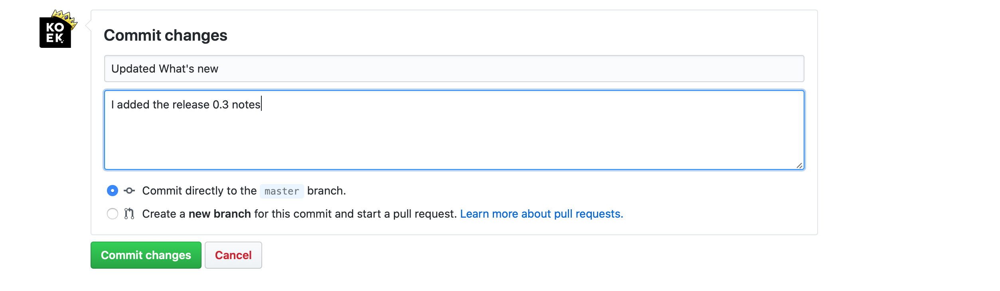

 
<html>
    

        <a href="https://github.com/Slaaatje/biskit-docs/edit/master/docs/contribute.md" target="_blank">Edit this page on GitHub
        </a>
    

</html>

## Edit pages
Would you also like to contribute to the documentation website of Biskit. For example, if you see a grammatical error or want to add a topic, click 'Edit this page on GitHub' at the top of the page. You'll be redirected to Biskit's GitHub page.

Log in with your GitHub account or create a new account. You'll be redirected to the edit page. Here you can make changes to the content.

                  

Did you make the adjustments? Then you still need to confirm the changes by re-committing the page. You can do this by setting a title at the bottom of the page for commit changes and a description of what you've done and then click commit. Now the page will be updated with the new content. 

         

***

## Report a bug or request a feature
Interested in contributing to Biskit? You can help us. Contributions are not limited to code. We also encourage
 feedback, documentation, new designs, patterns and tools.

All you need is a public [GitHub](https://www.github.com/) account to get started. If working with GitHub sounds like
 a lot, check out this [free video series](https://egghead.io/courses/how-to-contribute-to-an-open-source-project-on-github).
 Contributions begin with a GitHub issue using one of these templates, you can ask for a new feature or report a bug:

 

<html>
<a href="https://github.com/Slaaatje/biskit-documentation/issues/new?assignees=&labels=new+feature&template=feature_request.md&title=" target="_blank">

  <a class
  ="text1">
  <h3 class="title" style="margin-top: 30px;">Request new  feature</h3></a>

<a href="https://github.com/Slaaatje/biskit-documentation/issues/new?assignees=&labels=bug&template=bug_report.md&title=" target="_blank">

  <a class
  ="text1">
  <h3 class="title" style="margin-top: 30px;">Report a  bug</h3></a>

 
</html>

           

***

## GitHub issue/request
Fill in your request or problem here. Give a clear title for example if you would like to see the subject coloring in
 Biskit give the title the name color. Please describe your request in one or two sentences.
                                       
Clarify if you are asking for design, development, or both design and development. Finally click on submit new issue
.  

 <!-- Hotjar Tracking Code for https://ruud.koek.link/biskit/docs/#/ -->
 