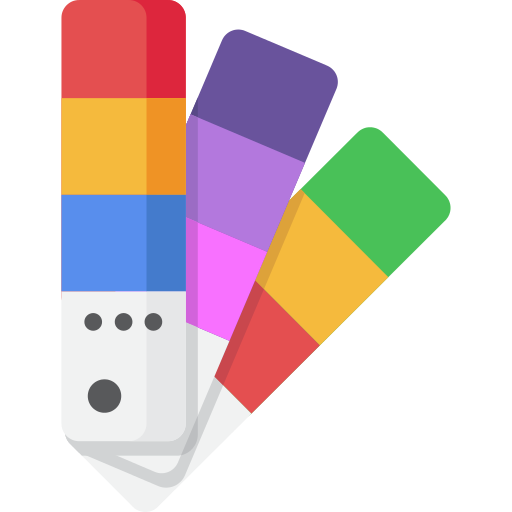
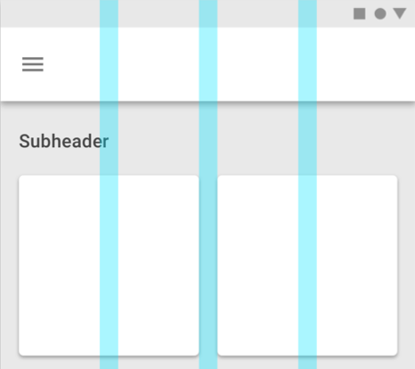

<!-- Hotjar Tracking Code for https://ruud.koek.link/biskit/docs/#/ -->

  

# Designers
A guide for designers how to start a new project and how to use the tools in the process.

## Visual Elements
The foundational visual elements of our Koek Design Language:

- [Koek Brandbook](https://ruud.koek.link/biskit/docs/_images/inside_final.pdf)
- Colors Coming soon!
- Typography Coming soon!
  

***

## Mechanics
The logic and relationships between spacing, layout, typography, and sizing of all elements:

- [Grid](grid.md "Grid - Biskit")
- [8-pixel Atomic grid](typography.md "Typography - Biskit")
  

***

## Tools
To streamline design efforts, share files, and automate as much as possible, we use Sketch. If you’re brand new to
Sketch, they offer some [great tutorials and help docs.](https://www.sketch.com/docs/) For more information about how
to use Sketch go to the [Sketch workflow](sketch-workflow.md "Sketch workflow - Biskit") page. For you coders out
there, we’ve got a robust UI component library built with AngularJS.

## - 1. Install Sketch
To design with Biskit you must have the most recent version of [Sketch](https://www.sketch.com/) installed.

## - 2. Download the Biskit Design Kit
The Biskit Design Kit is a living, breathing document that contains all of our visual assets (components, iconography, color palettes, grids, templates, responsive behavior, etc). This document evolves and changes as we collaborate with partners and service teams. 

<html>
<a href="https://github.com/Slaaatje/biskit/" target="_blank">

  

  <h3 class="title" style="margin-top: 30px;">Biskit Design Kit</h3>
  

</a>
</html>

            

## - 3. Or download the libraries separately
Download here the colors, typography, icon or grid library and add them to your project in Abstract.

<html>
<a href="https://github.com/Slaaatje/biskit-colors" target="_blank">
    

      

      <h3 class="title" style="margin-top: 30px;">Biskit   Colors</h3>
      

    </a>
<a href="https://github.com/Slaaatje/biskit-typography" target="_blank">

  

  <h3 class="title" style="margin-top: 30px;">Biskit  Typography</h3>
  

</a>
<a href="https://github.com/Slaaatje/biskit-icons" target="_blank">

  

  <h3 class="title" style="margin-top: 30px;">Biskit  Icons</h3>
  

</a>
<a href="https://github.com/Slaaatje/biskit-grid" target="_blank">
    

      

      <h3 class="title" style="margin-top: 30px;">Biskit   Grids</h3>
      

    </a>
</html>

                

## - 4. Use the libraries in Abstract
Go to the guidelines page - [use Biskit for new projects](https://ruud.koek.link/biskit/docs/#/new-project). Here you'll find step-by
-step instructions on how to use the libraries in your design phase.

