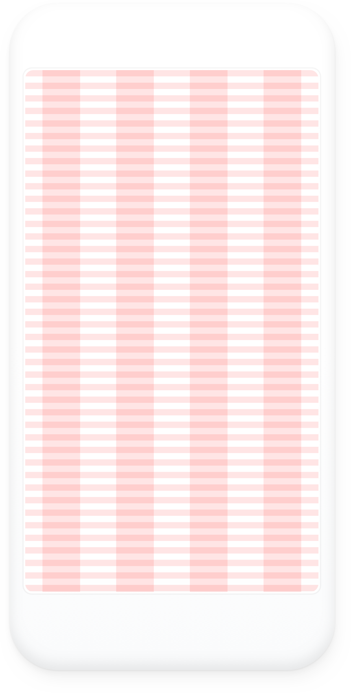
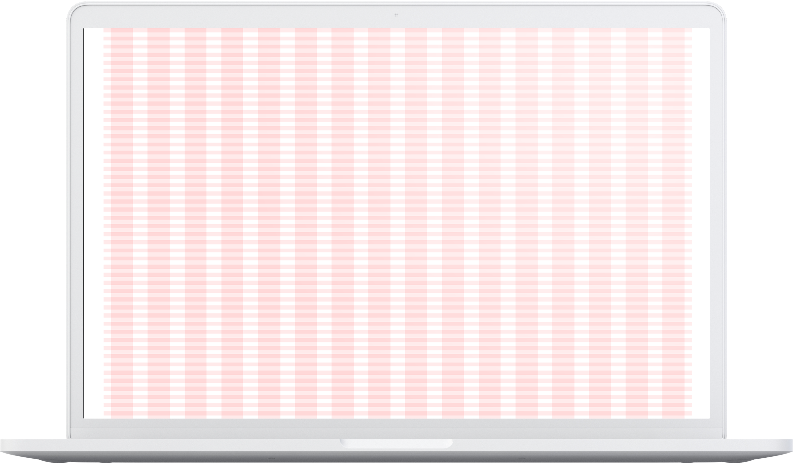
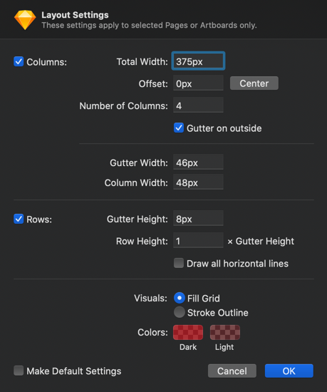
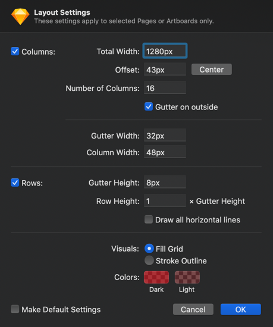
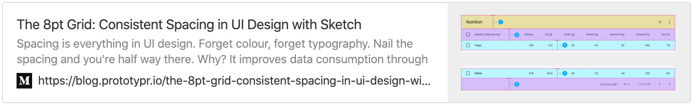

  

# Grid
Grid systems are used for creating page layouts through a series of rows and columns that house your content. Biskit
uses a responsive grid system that appropriately scales up to 12 columns as the device or viewport size increases.

## Why is grid so important?
- Grids give order to layout, making it easier for users to find and navigate information.
- Grids bring consistency in all the pages, giving it structure and harmony in the design.
- Grids allow collaboration with the other designers, thanks to the common baseline.
 

*** 

## Layouts
The layouts we use at Koek are for mobile and desktop, for mobile we use the iPhone 8 layout with 375px wide and for
 desktop we use 1366px wide. Mobile we use a 4 column layout and for desktop 16 column layout.

 

 

**Layout settings**

Use these settings at the beginning of your design process, this way every page of the design has the same layout and there is more consistency in the design. 
  
 
  

#### Download the grid layout for Sketch
<a href="https://github.com/Slaaatje/biskit-grid" target="_blank">
    

      

      <h3 class="title" style="margin-top: 30px;">Biskit   Grids</h3>
      

    </a>
               

***

## Sources

         

                                                           
                                                        

