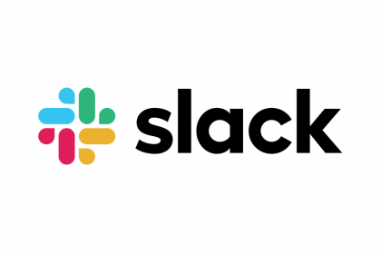

 
<html>
    

        <a href="https://github.com/Slaaatje/biskit-docs/edit/master/docs/introduction.md" target="_blank">Edit this page on GitHub
        </a>
    

</html>
 

# Introduction - Biskittt
An user-friendly, open source design system. :cookie: HMM
 

> "Without a shared design language and practises, collaboration is difficult" - Alla Kholmatova
 

 ***

## About BiskitDOET DIE HET?
Biskit is [Koek's](https://www.koek.nl) open-source design system for digital products and experiences. With
 the Koek Design Language as its foundation, the system consists of working code, design tools, resources and human
  interface guidelines. This is the start for an existing project or to start a project from scratch. Biskit contains
   these subjects:
 

<html>

  

  <h3 class="title" style="margin-top: 30px;">Biskit Design Kit</h3>
  

  
   

Discover <a href="https://ruud.koek.link/biskit/docs/#/designers">resources</a>, that'll help with your design workflow.

    

  

  <svg class="chevron" xmlns="http://www.w3.org/2000/svg" viewBox="0 0 100 35" width="30"><path d="M5 30L50 5l45 25" fill="none" stroke="#000" stroke-width="5"/></svg>

  

  <h3 class="title" style="margin-top: 30px;">Way of Working</h3>
  

  
   
Discover tools, that'll help with your daily workflow.

    

  

  <svg class="chevron" xmlns="http://www.w3.org/2000/svg" viewBox="0 0 100 35" width="30"><path d="M5 30L50 5l45 25" fill="none" stroke="#000" stroke-width="5"/></svg>

</html>

             

 ***

## How To Contribute
[Contributions](contribute.md) to Biskit on GitHub are welcomed! Whether you have questions, concerns, or suggestions for
 improving
 Biskit - please don't hesitate to reach out to us here. :speech_balloon:
 

 
  
<!-- Hotjar Tracking Code for https://ruud.koek.link/biskit/docs/#/ -->

