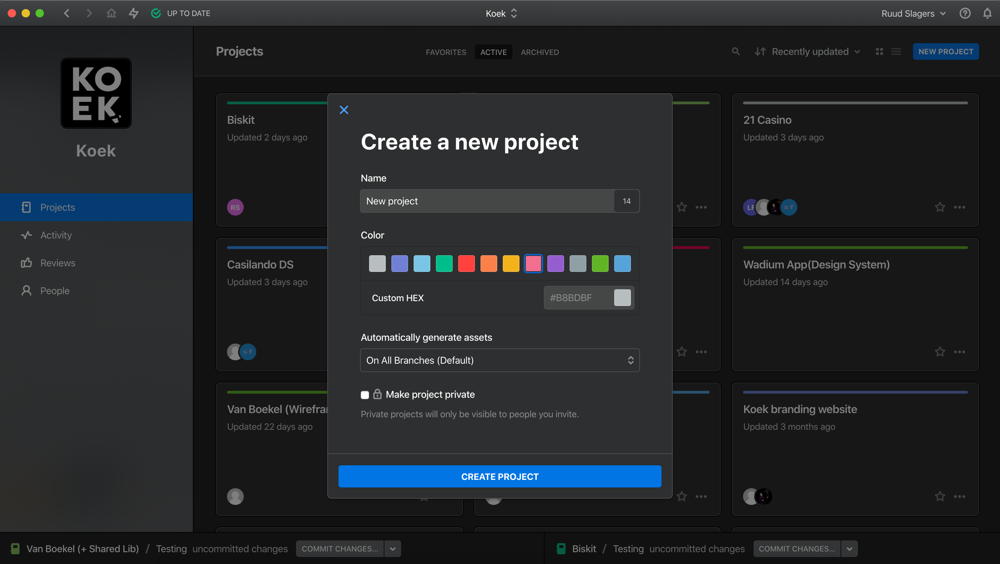
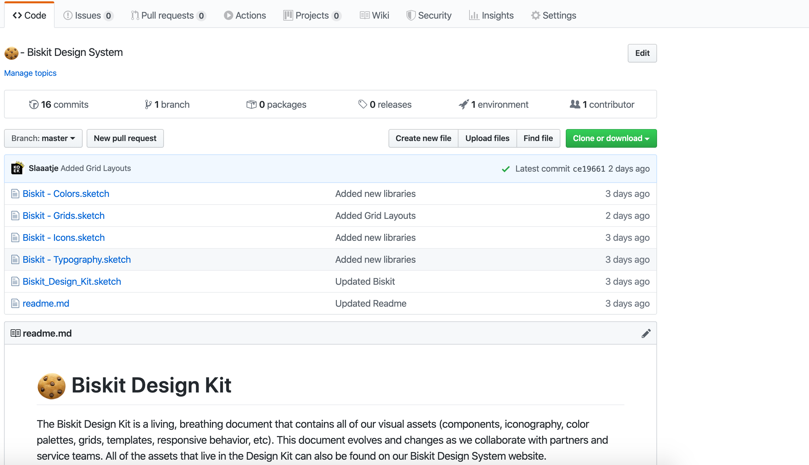

 
<html>
    

        <a href="https://github.com/Slaaatje/biskit-docs/edit/master/docs/new-project.md" target="_blank">Edit this page on GitHub
        </a>
    

</html>
 

# How to use Biskit for new projects
What is the best way to use Biskit in new projects? Follow these steps when setting up a new project.
 

 ***

## - 1. Use Abstract
Abstract is a version control program for Sketch. Go to the [Abstract page](https://ruud.koek.link/biskit/docs/#/abstract) for more explanation.
Create a new project in Abstract. The next step is to add the Biskit Sketch libraries.

*Create new project in Abstract*
 

***

## - 2. Download the Biskit Sketch libraries
Download the latest Biskit Sketch libraries. You can download them on the [page 'Designers'](https://ruud.koek.link/biskit/docs/#/designers).

*Download all of the libraries*
 

***

## - 3. Add the libraries to Abstract.
Add the libraries you want to use to the master environment in Abstract.

 

*Add the Sketch libraries to Abstract*
 

***

## - 4. Start your design.
Add the last Sketch file **Biskit_Design_Kit.sketch** where the symbols will be placed and where all the designs will
 be.

 

*Add the components page and start designing*
 

***

## - 5. Change the libraries to the style of the customer.
The Sketch libraries are now generally designed, change them to the style of the customer. This is done by modifying the libraries in your design file. See video below how.

 

*Demonstration how libraries can be adapted*
 

***

## - 6. Turn your components into symbols.
Convert your components to symbols, so you can reuse them. Then add the symbols to the components page, so that the components page will be transferable to the developers.

 

*Demonstration how to make your components into symbols*
 

***

<!-- Hotjar Tracking Code for https://ruud.koek.link/biskit/docs/#/ -->

