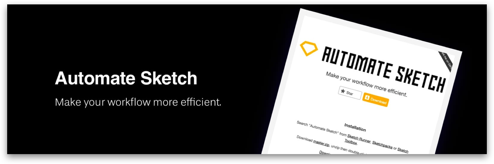

<!-- Hotjar Tracking Code for https://ruud.koek.link/biskit/docs/#/ -->

  

# Sketch plugin
Sketch combined with the right plugins will move your workflow to the next level. :rocket:

As a designer, you need a solid process to make your workflow efficient. It’s even more crucial when you’re starting, because you can avoid a lot of inefficient, time-wasting bottlenecks. One of the things that set Sketch apart is the sheer amount of plugins and resources.

This section assumes that you’re already familiar with Sketch. We’re going to focus on the best plugins. If you wish to
 learn the basics, I suggest heading to this website about [learning Sketch](https://designcode.io/sketch-learn).
  

 ***

## Sketch Runner
Probably the most popular and efficient plugin of all is Sketch Runner. It’s absolutely the first thing you need to
download. Runner is an essential multi-purpose Plugin (on steroids) for inserting UI elements and installing new
plugins. It’s like the Mac’s Spotlight or Alfred within Sketch. To developers, this is the equivalent of Packages in
Atom. And it can do so much more!

 
 
           

 ***

## Rename It
Rename It helps you keep your Sketch files organized, batch rename layers and artboards. You can find and replace
layer or artboard names. Use advanced options to add layer width, height, order them alphabetically or create a
numeric sequence. You may also convert names to title case, lower case and many more things.

 

           

 ***

## Symbol Swapper
Swap the selected symbols and/or symbol instances to another master, or swap entire libraries.

 

            

 ***

## Automate
Make your workflow more efficient.

 

            

 ***

