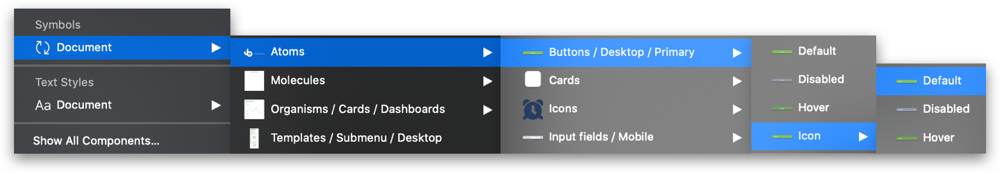
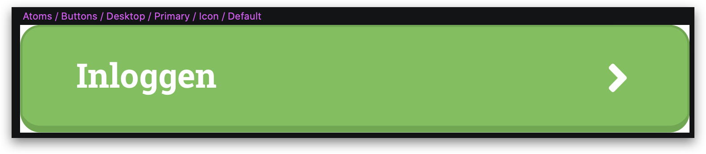
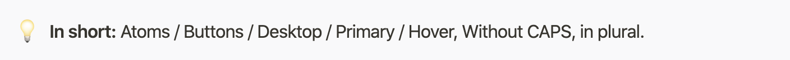
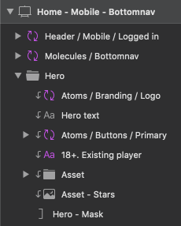
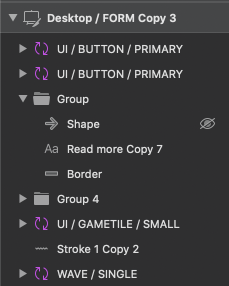
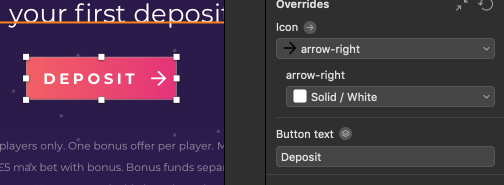
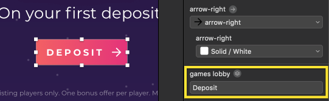
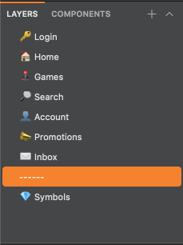

 
<html>
    

        <a href="https://github.com/Slaaatje/biskit-docs/edit/master/docs/sketch-workflow.md" target="_blank">Edit this page on GitHub
        </a>
    

</html>
 

# Sketch - Naming Conventions & Order
How to apply good names in Sketch en when to use them.
  

 ***

## About Sketch
[Sketch](https://www.sketch.com/) is a design toolkit built to help you create your best work.
  

 ***

## Naming Files
We use [Abstract](abstract.md) for versioning, so naming our Sketch files is of less importance
. Naming the Abstract project however
 is. We use the name of the project (Not the client) for this. 
   
 
 
 ***
 
 
 
## Naming Symbols
Symbols ([Atomic Design](https://bradfrost.com/blog/post/atomic-web-design/)) Level and element always written in plural, the first character is a capital letter and
 there are spaces before and after a '/' like:
 
 ##### **Niveau / Element / Device / Type / S**

For symbols we use the Atomic Design theory by Brat Frost. The naming is as follows:

- **Level:** in this case, indicates if the symbol is an Atom, Molecule, Organism, Template or Page. 

- **Element:** is the component itself, e.g. Button, Dialog, Branding etc. 

- **Device:** is, obviously, the device the component is used for. When the component is available on both desktop and mobile 
(in exactly the same form) you can leave out device.

- **Type:** is the type of component. For example a button has different types like: Primary, Secondary, Ghost etc. 

- **State:** The state of the type. Again, if we talk about buttons "Active", "Hover", "Default" and "Disabled" would be states of that button.

### Example
 
 
 

*Example of Atomic Design in Sketch.*
      
  
    
 ***
 
 
 ## Layers
 Name your layers! This is not based on an intricate naming scheme. Just imagine opening your file, or worse someone
 else opening your file, a year from now and come to to the discovery that there are 200 layers named 'Rectangle 21
 Copy 59' in 'Group 6 Copy 12'. You'd be looking like this lady..
 
 
 
 So name your layers in a way that is understandable for both designers and
 programmers. Another rule of thumb is that you can get from the top of the file (for example the header) in a
 chronological way to the bottom, by using TAB button.
    
  
  
            
  😃*This makes future you happy*        😪*This makes future you sad*
   
  ***
 
  ## Symbols overrides
Sketch overrides are a great way to make symbols more dynamic. The layer's name, within  the symbol, is used as a
label for overrides. So make sure they are generic and not specific to the place the symbol was first used. For
example: When we have an input field with a placeholder text call that label "Placeholder" not "Password".
    
  
  
       
  😃*Icon and Button text can be used anywhere.*       
  😪 *Arrow right may not be an arrow elsewhere. Games
  lobby is
  Deposit in this screen, what a mess.* 
  
***

  ## Naming Artboards
Naming artboards is simple. We use the following structure:

 ##### **Category - Detail (optional) - State (optional) - Breakpoint**
 
So en example would be: Game - Game detail - Logged out - Desktop. Never use '/', always use '-'. When you use a
slash, Sketch will create annoying folders when exporting the screen. 
 
 

***
 
   ## Naming Pages
Pages are named after their page within the website (e.g. /account or /search). We use emoji to indicate what the
pages contain, for easier scanning. Both Mobile and Desktop screens are in the same page. 
  
 
            
  🥰*Look how well-arranged this is.* 

  
  
    
 